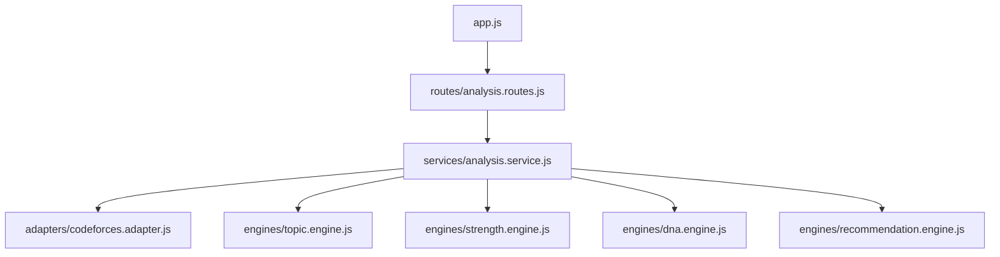

# CoDNA AI MVP Backend Established

We have successfully transitioned the CoDNA AI prototype from a collection of standalone scripts into a real, robust API-driven backend platform! The intelligence layer is now completely modular, scalable, and ready to be connected to a frontend or database.

## Architecture Transformation

We followed your exact blueprint to reorganize the codebase into a clean, maintainable structure:



### Key Highlights
- **Config Driven**: Implemented `dotenv` with `src/config/index.js` to manage environment variables like `PORT`.
- **DRY Principle**: `formatTagName` and submission deduplication are now centralized utilities.
- **The Mega Object**: The `AnalysisService` aggregates all data to provide the frontend with exactly what it needs in a single request.
- **Backward Compatibility**: The old `scripts/` directory is kept intact so you can verify the new API logic against the prototype.

## Verified API Endpoint

> [!TIP]
> The server exposes the unified API at `GET http://localhost:3000/analyze/:handle`. 

When tested against `tourist`, it returned a highly structured JSON response encompassing all engines simultaneously:

```json
{
  "profile": {
    "handle": "tourist",
    "rating": 3428,
    "maxRating": 4009,
    "rank": "legendary grandmaster"
  },
  "topics": {
    "raw": { ... },
    "top": [ ... ]
  },
  "strengths": {
    "elite": [ ... ],
    "strong": [ ... ],
    "developing": [ ... ],
    "weak": [ ... ]
  },
  "dna": {
    "archetype": "The All-Rounder",
    "traits": [ "Marathoner" ]
  },
  "recommendations": [ ... ]
}
```

## Next Steps

> [!IMPORTANT]  
> The backend intelligence layer is now structurally sound. You can safely `git tag v1-prototype` and start planning the Next.js frontend or additional API endpoints (like `GET /benchmark/:handle/:competitor`).
